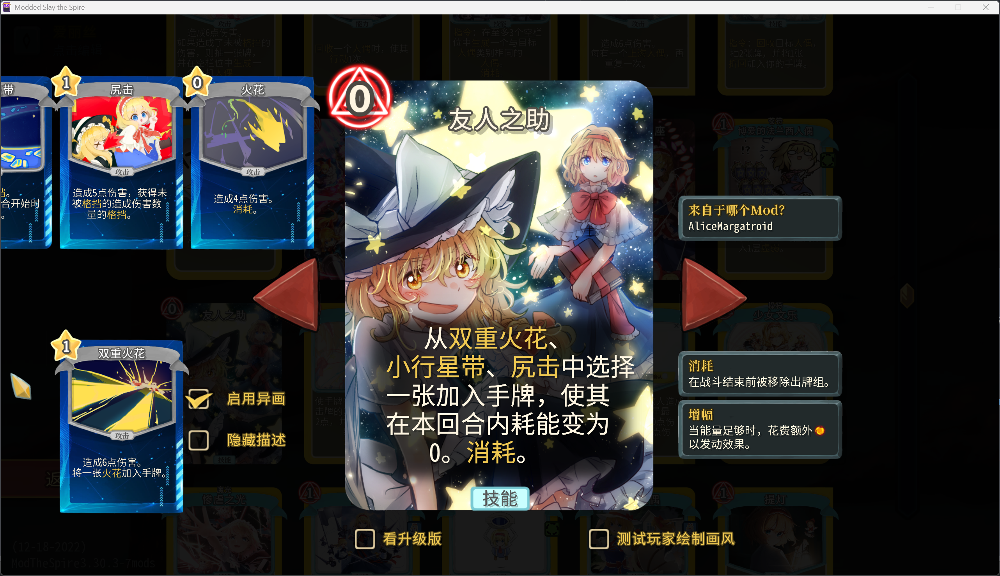
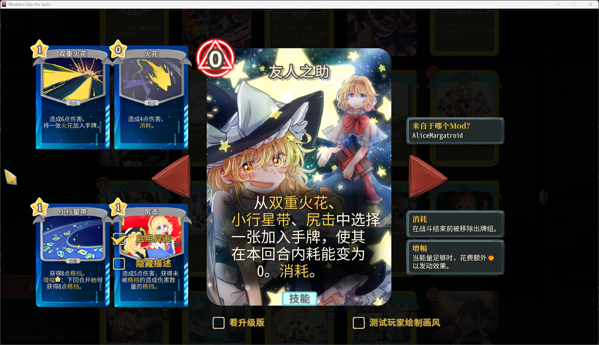

# STS Signature Lib

一个简单的异画库，允许你为自己的卡牌或者原版卡牌添加异画。 Signature 一词来源于炉石。

## 关于异画


异画牌简单来说就是没有背景，只有全幅大图的卡牌。

通常为了美观，异画牌会隐藏卡牌描述，只有鼠标悬停或进行选牌等操作时会显示。

方便起见，异画牌的卡图大小设定为 1024x1024 或 512x512，以方便渲染。

异画图的形状可以直接参照卡牌的不透明区域，也可以自行设计。

## 使用方法

### 添加异画

#### 1. 继承 AbstractSignatureCard 卡牌类

AbstractSignatureCard 的构造函数参数和 CustomCard 是完全一致的。

如果卡图路径中包括 "/cards/" 或者 "/card/"，则会将其替换成 "/signature/" 作为异画的默认路径；
否则将会使用原路径。

卡图文件的名称默认情况下以 "_s.png" 和 "_s_p.png" 结尾。

如果你的异画卡图符合上述规则，那么你只需要继承 AbstractSignatureCard 即可，不需要做任何额外的工作；

如果你的异画文件名不符合上述规则，可以通过重写 `getSignatureTexture` 和 `getSignaturePortraitImgPath` 方法来自定义异画文件名：

```java
@Override
public String getSignatureTexture() {
    return "path/to/your/cool/signature.png";
}

@Override
public String getSignaturePortraitImgPath() {
    return "another/path/to/your/cool/signature_portrait.png";
}
```

#### 2. 为原版卡牌添加异画

可以调用 `SignatureHelper.register()` 方法来为原版（或者其它不属于你的 mod）卡牌添加异画。

```java
public static void register(String id, Info info);
```

| 参数 | 说明 |
| --- |  |
| id | 卡牌的 ID |
| info | 异画卡图路径 |

示例：

```java
SignatureHelper.register(Miracle.ID,
         new Info("path/to/signature.png", "path/to/signature_portrait.png"));
```

## 解锁异画

异画默认为锁定状态，可以通过 `SignatureHelper.unlock()` 方法解锁。

```java
public static void unlock(String id, boolean unlock);
```

| 参数 | 说明 |
| --- |  |
| id | 卡牌的 ID |
| unlock | 是否解锁，如果是 false 会重新锁定 |

### 解锁条件

如果你想告知玩家如何解锁异画，可以在卡牌描述的 `.json` 文件中添加 `SIGNATURE_UNLOCK_CONDITION` 子段。

示例：

```json
"SignatureExampleMod:EverydayMomentsWithYou": {
  "NAME": "与你的日常",
  "DESCRIPTION": "*装载 一张 *奇迹+ 。 NL 如果从 *弹仓 中打出， *装载 这张牌；否则 消耗 。",
  "SIGNATURE_UNLOCK_CONDITION": "与你的日常， NL 就是奇迹。"
}
```

如果要给原版卡牌添加解锁条件，可以使用 `SignatureHelper.addUnlockConditions()` 方法：

```java
public static void addUnlockConditions(String jsonFile);
```

json 文件的格式为：

```json
{
  "ID_1": "解锁条件1",
  "ID_2": "解锁条件2",
  ...
}
```

如果不需要批量添加，也可以直接调用 SpireField 修改：

```java
UnlockConditionPatch.Fields.unlockCondition.set(
    CardCrawlGame.languagePack.getCardStrings(Miracle.ID),
    "与你的日常， NL 就是奇迹。");
```

## 自定义内容

### Style

Style 是异画的样式，包含了异画牌的类型说明框和卡牌描述的背景阴影，具体参数参见源代码。

在设置异画时，可以指定自己的 Style。如果 Style 的某项为 null，则会在渲染时跳过这一项。

### dontAvoidSCVPanel

默认情况下，大图预览界面的多卡预览会跳过异画勾选框的位置。

如果预览卡比较多，可以设置 `dontAvoidSCVPanel` 为 true，以防止预览卡超出屏幕——当然代价是会被勾选框挡住。





后者即为 `dontAvoidSCVPanel = true` 的效果。

## Debugging

方便起见，在 Mods 选项中可以开启调试模式，强制视为所有异画均为已解锁状态。

如果已经开发完成，在发布时可以在你的 Mod 中调用 `SignatureHelper.noDebugging(card.cardID)` 来禁止某张卡牌在调试模式中自动解锁。

如果你的卡牌 ID 有一个统一的前缀，也可以调用 `SignatureHelper.noDebuggingPrefix(prefix)` 来一次性禁止所有以该前缀开头的卡牌：

```java
SignatureHelper.noDebuggingPrefix("SignatureExampleMod:");
```

## 示例

可以参考 [SignatureExampleMod](https://github.com/antileaf/SignatureExampleMod) 来了解如何使用异画库。
